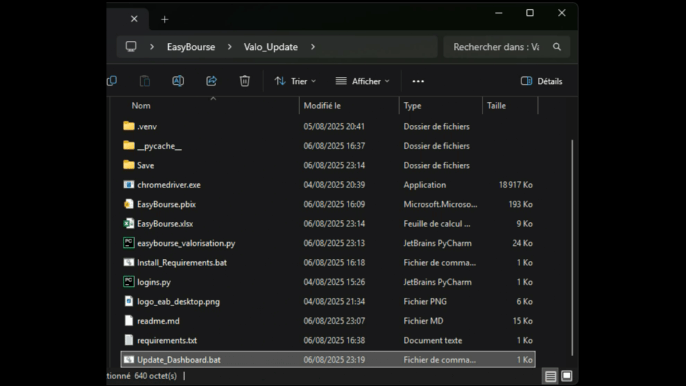

# Better Visuals For Your EasyBourse Financial Report

<div align="center">


<h3>Automated portfolio data extraction and visualization system for EasyBourse with Power BI integration</h3>

[**Features**](#key-features) • [**Demo**](#demo) • [**Installation**](#installation) • [**Usage**](#usage) • [**Documentation**](#documentation)

</div>

---

## Overview

This project provides a complete **automated solution** for extracting portfolio valuation data from EasyBourse platform, consolidating historical data in Excel, and creating advanced visualizations through Power BI. It eliminates manual data collection while maintaining a comprehensive historical database of your investments.

### Why This Project?

- **Save Time**: Automate hours of manual data entry
- **Track History**: Build a complete historical database of your portfolio evolution
- **Better Insights**: Power BI provides superior analytics compared to native EasyBourse interface
- **Real-time Updates**: Automatic hourly refresh when running
- **Data Security**: All data stays local on your machine

## Key Features

- **Automated Web Scraping** - Selenium-based secure connection and data extraction
- **Virtual Keyboard Support** - Handles EasyBourse's security features automatically
- **Historical Data Management** - Intelligent merging of new data with existing records
- **Automatic Backups** - Maintains the last 10 versions for data safety
- **Power BI Integration** - Direct connection for advanced analytics
- **Continuous Updates** - Hourly automatic refresh while running
- **Headless Mode** - Runs silently in the background

<div align="center">

## Demo

### 1. Automated Data Extraction

The script automatically connects to EasyBourse using Selenium WebDriver in headless mode.  
Once authenticated, it directly accesses the real-time CSV export URL and downloads the complete portfolio valuation data.  
The entire process is logged in the console, showing connection status, download progress, and data parsing steps.

<table>
   <tr>
      <td></td>
      <td></td>
   </tr>
</table>
<br><br>

[Space for GIF: Console output showing the extraction process with progress indicators]

### 2. Power BI Dashboard Update

After successful data extraction, the script processes the CSV file and updates the Excel database with new information. The Power BI dashboard then opens automatically, ready for a one-click refresh. The Excel file serves as the data source for Power BI, maintaining full historical records while adding new valuation dates. The update process preserves all existing data, intelligently merging new positions and updating existing ones based on the valuation date.

[Space for GIF: Power BI opening and refreshing with new data]

### 3. Interactive Dashboard Analysis

The Power BI dashboard transforms raw portfolio data into actionable insights. Users can explore their portfolio through multiple perspectives: temporal evolution charts showing portfolio value over time, sector allocation pie charts, individual position performance metrics, and gain/loss analysis by security. Interactive filters allow deep dives into specific time periods or asset classes. The dashboard updates in real-time as new data is imported, providing always-current portfolio analytics.

[Space for GIF: Navigating through different dashboard views and using interactive filters]

</div>

## Installation

### Prerequisites

- Python 3.8 or higher
- Google Chrome (latest version)
- ChromeDriver (compatible with Chrome version)
- Power BI Desktop
- Active EasyBourse account

### Quick Setup

1. **Clone the repository**
```bash
git clone https://github.com/your-username/easybourse-automation.git
cd easybourse-automation
```

2. **Install dependencies**
```bash
# Using the provided script
Install_Requirements.bat

# Or manually
pip install -r requirements.txt
```

3. **Configure credentials**
```python
# Edit logins.py
id = "your_easybourse_id"
password = "your_password"
```

4. **Install ChromeDriver**
   - Check your Chrome version: `chrome://version/`
   - Download from [ChromeDriver](https://chromedriver.chromium.org/)
   - Add to system PATH

## Usage

### Standard Operation

Simply double-click `Update_Dashboard.bat` to:
1. Launch the extraction process
2. Update the Excel database
3. Open Power BI Dashboard
4. Continue running with hourly updates (can be minimized)

### Manual Execution

```bash
python easybourse_valorisation.py
```

### First Time Setup

On first run, the script will:
- Create the Excel database (`EasyBourse.xlsx`)
- Set up the backup folder (`Save/`)
- Extract your complete current portfolio

## Documentation

### Project Structure

```
easybourse-automation/
│
├── Core Files
│   ├── easybourse_valorisation.py    # Main extraction engine
│   ├── logins.py                      # Credentials (git-ignored)
│   └── requirements.txt               # Python dependencies
│
├── Execution
│   ├── Update_Dashboard.bat           # One-click launcher
│   └── Install_Requirements.bat       # Dependency installer
│
├── Data & Visualization
│   ├── EasyBourse.xlsx               # Generated database
│   ├── EasyBourse.pbix               # Power BI dashboard
│   └── Save/                         # Automatic backups
│
└── Documentation
    └── README.md                      # This file
```

### Technical Implementation

#### 1. Initialization Phase

The script begins by setting up the execution environment. It configures the logging system to track all operations, defines the download directory for temporary files, and initializes the Chrome WebDriver with specific options for headless operation and automatic file downloads.

```python
def setup_driver(self):
    """Configure and return a Selenium driver with automatic download"""
    options = Options()
    
    # Download configuration
    prefs = {
        "download.default_directory": self.download_dir,
        "download.prompt_for_download": False,
        "download.directory_upgrade": True,
        "safebrowsing.enabled": True
    }
    options.add_experimental_option("prefs", prefs)
    
    # Headless mode configuration
    options.add_argument('--headless=new')
    options.add_argument('--window-size=1920,1080')
    options.add_argument('--disable-blink-features=AutomationControlled')
    
    driver = webdriver.Chrome(options=options)
    return driver
```

#### 2. Authentication Process

The authentication phase handles EasyBourse's multi-step login process. The script navigates to the login page, automatically enters the username, then detects whether a virtual keyboard is present for password entry. If detected, it maps the keyboard layout and clicks the appropriate digits. The system also manages cookies and other security features automatically.

```python
# Virtual keyboard detection and usage
virtual_keyboard = None
for key_id in range(1000):
    try:
        elements = driver.find_elements(By.CLASS_NAME, f"jss{key_id}")
        digits = [el.text.strip() for el in elements if 
                 el.text.strip().isdigit() and len(el.text.strip()) == 1]
        if set(digits) == set("0123456789"):
            virtual_keyboard = elements
            logger.info(f"Virtual keyboard detected with jss{key_id}")
            break
    except:
        continue

# Click digits on virtual keyboard
if virtual_keyboard:
    for digit in self.password:
        for button in virtual_keyboard:
            if button.text == digit:
                button.click()
                time.sleep(0.2)
                break
```

#### 3. Data Extraction

Once authenticated, the script navigates directly to the CSV export URL, bypassing the need to click through multiple pages. It monitors the download directory for the new CSV file, verifying its completion before proceeding. The download timeout is configurable to accommodate slower connections.

```python
def download_valorisation_csv(self, driver):
    """Download the CSV valuation file"""
    # Direct navigation to CSV export URL
    driver.get('https://www.easybourse.com/easybourse/secure/'
               'exportCsvValorisationTempsReel.html?siteLanguage=fr')
    
    files_before = set(os.listdir(self.download_dir))
    timeout = 30
    start_time = time.time()
    
    # Wait for download completion
    while time.time() - start_time < timeout:
        files_after = set(os.listdir(self.download_dir))
        new_files = files_after - files_before
        csv_files = [f for f in new_files if f.endswith('.csv')]
        
        if csv_files:
            csv_filename = csv_files[0]
            logger.info(f"CSV file downloaded: {csv_filename}")
            return os.path.join(self.download_dir, csv_filename)
        
        time.sleep(1)
    return None
```

#### 4. Data Processing

The CSV parsing phase extracts multiple data layers from the downloaded file. First, it captures the valuation date from the header. Then it extracts portfolio totals (total value, cash balance, positions total) from summary rows. Finally, it processes each individual position with all associated metrics, converting French number formats (commas for decimals, spaces for thousands) to standard formats.

```python
def parse_csv_data(self, csv_path):
    """Parse CSV file and extract data with totals as columns"""
    with open(csv_path, 'r', encoding='cp1252') as f:
        content = f.read()
    lines = content.split('\n')
    
    # Extract valuation date
    date_match = re.search(r'Valorisation au;(\d{2}/\d{2}/\d{4})', lines[2])
    if date_match:
        valorisation_date = datetime.strptime(date_match.group(1), '%d/%m/%Y')
    
    # Extract totals
    totals_dict = {}
    for i in range(7, 13):
        if i < len(lines) and lines[i].strip():
            parts = lines[i].split(';')
            if len(parts) >= 2:
                label = parts[0].strip()
                montant = float(parts[1].strip().replace(',', '.').replace(' ', ''))
                totals_dict[label] = montant
    
    # Parse positions data
    df = pd.read_csv(io.StringIO(positions_content), sep=';', decimal=',')
    
    # Convert numeric columns
    for col in ['Quantité', 'Cours', 'Valorisation', '+/- value']:
        df[col] = df[col].apply(lambda x: float(str(x).replace(' ', '').replace(',', '.')))
    
    # Add totals as columns
    for col_name, value in totals_dict.items():
        df[col_name] = value
    
    return df
```

#### 5. Historical Consolidation

The consolidation logic represents the core intelligence of the system:

```python
def update_excel(self, df_new, excel_path='EasyBourse.xlsx'):
    """Update Excel file with new data including total columns"""
    if os.path.exists(excel_path):
        df_existing = pd.read_excel(excel_path, sheet_name='Data')
        
        # Process each date in new data
        for date in df_new['Date'].unique():
            df_date_new = df_new[df_new['Date'] == date].copy()
            
            if date in df_existing['Date'].values:
                # Update existing date
                for idx, row in df_date_new.iterrows():
                    valeur = row['Valeur']
                    mask = (df_existing['Date'] == date) & (df_existing['Valeur'] == valeur)
                    
                    if mask.any():
                        # Update existing position
                        update_idx = df_existing[mask].index[0]
                        for col in df_new.columns:
                            df_existing.at[update_idx, col] = row[col]
                    else:
                        # Add new position to existing date
                        date_mask = df_existing['Date'] == date
                        last_idx = df_existing[date_mask].index[-1]
                        df_existing = pd.concat([
                            df_existing.iloc[:last_idx + 1],
                            pd.DataFrame([row]),
                            df_existing.iloc[last_idx + 1:]
                        ], ignore_index=True)
            else:
                # Insert new date chronologically
                df_existing = pd.concat([df_existing, df_date_new])
    
    # Sort and save
    df_combined = df_existing.sort_values(['Date', 'Valeur'])
    df_combined.to_excel(excel_path, sheet_name='Data', index=False)
```

| Scenario | Action |
|----------|--------|
| **New date** | Insert chronologically with all positions |
| **Existing date - Known position** | Update values and metrics |
| **Existing date - New position** | Add to existing date block |
| **Totals management** | Propagate to all rows of same date |

This ensures a complete historical record while keeping current data up-to-date.

#### 6. Export and Backup

Before modifying the Excel file, the script creates a timestamped backup in the `Save/` directory. It maintains the 10 most recent backups automatically, deleting older ones. The updated data is then exported to Excel with proper formatting, column widths, and highlighted total columns for easy identification in Power BI.

```python
def backup_excel(self, excel_path):
    """Create a backup of the Excel file before modification"""
    if os.path.exists(excel_path):
        backup_dir = 'Save'
        os.makedirs(backup_dir, exist_ok=True)
        
        # Create timestamped backup
        timestamp = datetime.now().strftime('%Y%m%d_%H%M%S')
        backup_path = os.path.join(backup_dir, f'EasyBourse_backup_{timestamp}.xlsx')
        shutil.copy2(excel_path, backup_path)
        
        # Clean old backups (keep only last 10)
        backups = sorted([f for f in os.listdir(backup_dir) if f.endswith('.xlsx')])
        if len(backups) > 10:
            for old_backup in backups[:-10]:
                os.remove(os.path.join(backup_dir, old_backup))
```

### Data Structure

| Column | Type | Description |
|--------|------|-------------|
| **Date** | DateTime | Valuation date |
| **Valeur** | String | Security name |
| **Code Isin** | String | International identifier |
| **Quantité** | Float | Number of shares |
| **Cours** | Float | Current price |
| **Prix moyen** | Float | Average purchase price |
| **Valorisation** | Float | Total position value |
| **+/- value** | Float | Unrealized P&L |
| **Performance (%)** | Float | Return percentage |
| **Valeur totale** | Float | Portfolio total value |
| **Solde espèces** | Float | Cash balance |
| **Total positions sous dossier** | Float | Sum of all positions |

---

<div align="center">

### Project Status


**Note:** This project is not affiliated with EasyBourse, Crédit Agricole, or any financial institution.

</div>
